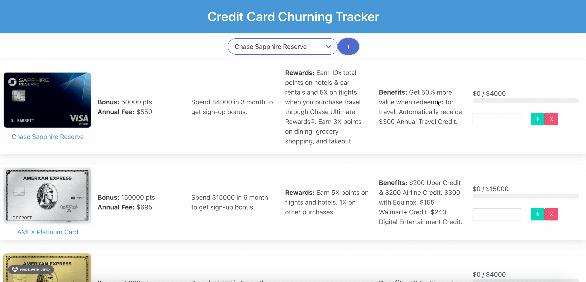

## Description
This is a small personal project that helps users track credit cards, spending progress towards sign-up bonus, rewards, and benefits.

**What is credit card churning:**
- The process involves applying for a credit card, getting approved, meeting a minimum spend within a set amount of time, earning a large welcome bonus, and canceling the card before the next annual fee is due.

**Why did I create this?**
- I created this app because checking credit card progress across multiple banking apps can be cumbersome. This would be a central hub for all your cards in one glance.

**How do I use this?**
1. Install dependencies: `npm install`
2. Substitute username with your own username and dbname with your own database name, the run `pg_dump -U username dbname > schema.sql` to Load the schema file into your postgreSQL database.
3. Run `npm run server` to start up the node server.
4. Run `npm run build` to run webpack.
5. Run http://localhost:3000/ in the browser.

## Demo

<a href='https://youtu.be/aE5JUTjqLDc'>Full Demo on Youtube</a>

Adding Credit Cards

Adding Spend Towards Threshold

## Tech Stack
- PostgreSQL
- Express.js
- React.js
- Node.js
- Bulma CSS

## Future Roadmap
1. Add a feature to show how many days are left on the spending window
2. Deploy the application.
3. Create an actual credit card API that houses the all info from credit cards. It is currently using my own local database.
